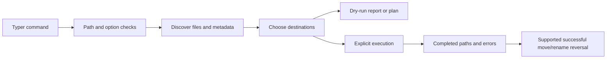

# photo-toolkit technical manual

## What this tool is

`photo-toolkit` is an alpha Python CLI for inspecting and preparing copies of media libraries. It can inventory files, compare dates, hash exact duplicates, rename/move associated files, produce reviewed plans, update selected metadata through ExifTool, strip GPS tags, and optionally convert HEIC images to JPEG. The executable is `photo`; command wiring lives in [photo/cli.py](../photo/cli.py).

A **sidecar** is a separate file such as `.xmp` or `.aae` containing metadata associated with an image. A **Live Photo pair** is an image and same-stem `.mov` file, recognized here by a filename heuristic. **EXIF** is image metadata that can include capture dates and GPS fields. A **hash** is a fingerprint of file bytes: equal SHA-256 values are used to identify exact duplicates, not visually similar photographs.

There is no login, cloud API, asset database, or automatic importer. Names such as Immich and PhotoPrism describe preparation targets, not authenticated integrations. The process runs with your filesystem privileges. Dry run protects against intended media mutations, but reports and plan files are still written. This is not a sandbox or a backup system.

## Install and test without touching real media

Use Python 3.10+ and an isolated environment:

```sh
python3 -m venv .venv
. .venv/bin/activate
python -m pip install -e '.[dev]'
python -m pytest
python -m compileall -q photo
python -m pip check
photo --help
```

[pyproject.toml](../pyproject.toml) declares Typer, Rich, and PyYAML; pytest is a development extra, and Pillow/pillow-heif form the optional `heic` extra. Typer provides the command parser and Rich formats terminal output. The example YAML files are not automatically loaded as presets by the current CLI.

ExifTool must be separately available on PATH for metadata writes. Without it, metadata reading returns an empty mapping; filename dates can still be used. Install HEIC support with `python -m pip install -e '.[heic]'` only when testing conversion on disposable valid HEIC fixtures. The base test suite uses synthetic bytes and mocks, not real photo collections or full codec/ExifTool integration.

No environment secrets are required. The current working directory determines the default run-log and report destinations. Do not run these commands from a real library root for a learning exercise. This complete workflow creates only temporary synthetic files:

```sh
LAB="$(mktemp -d)"
mkdir "$LAB/source"
printf 'synthetic image bytes' > "$LAB/source/20200101_091011_camera.jpg"
cp "$LAB/source/20200101_091011_camera.jpg" "$LAB/source/copy.jpg"
printf 'synthetic sidecar' > "$LAB/source/20200101_091011_camera.xmp"
cd "$LAB"
photo verify source
photo hash source --output hashes.csv
photo remove-duplicates source --move-to duplicates
photo plan source --mode move-prefix --prefix 20200101 --move-to staged --output plan.json
cat plan.json
photo apply-plan plan.json
photo apply-plan plan.json --execute
```

The first apply is a preview: source files remain. The explicit execution moves the timestamped image and sidecar into `staged`; `copy.jpg` remains in `source`. The fake JPEG is useful for filesystem tests, not image decoding. Do not use metadata-writing or conversion commands on this byte fixture.

Read the path printed by the execution run, then preview undo with `photo undo <that-run-directory>`. Replace the placeholder with the exact path; `--execute` performs the reversal. Never use a guessed “latest” run: multiple operations can occur in the same second.

## Commands and real boundaries

| Command | What it does | Mutates media with `--execute`? |
| --- | --- | --- |
| `verify` | File size/type/zero-byte/date inventory | No |
| `hash` | SHA-256 CSV manifest of supported media | No |
| `date-audit` | Compare filename and metadata date fields | No |
| `validate-import` | Heuristic warnings for a named target | No |
| `report` | CSV inventory and HTML summary | No |
| `move-prefix` | Top-level prefix matches plus associated files | Yes |
| `rename-from-exif` | Rename from selected capture date; filename date has precedence | Yes |
| `fix-date`, `fix-year` | Change primary metadata and rename associated files | Yes |
| `plan` | Write versioned JSON for supported move/rename/date operations | No |
| `apply-plan` | Preview/apply supported operations from reviewed JSON | Yes |
| `undo` | Reverse proven completed move/rename records | Yes |
| `remove-duplicates` | Keep lexicographically first member of each exact hash group | Yes, with a move destination or explicit deletion |
| `strip-gps` | Invoke ExifTool GPS removal | Yes |
| `convert-heic` | Create JPEG derivatives in a distinct output folder | Yes |

Read [commands.md](commands.md) for flags. Duplicate deletion additionally requires `--delete`; combining it with `--move-to` is rejected. Moving to a review folder is usually easier to inspect than deleting. Exact duplicates may be meaningful copies in different contexts: byte identity does not establish which file a person wishes to keep.

`verify` is an inventory check, not full image decoding or corruption certification; its `readable` field is not proof that an image viewer can decode the media. `validate-import` is a heuristic report, not a compatibility certificate from any named product. Conversion is a derivative-image workflow and does not promise preservation of every metadata field or Live Photo association.

## Source map and architecture

| Source | Responsibility |
| --- | --- |
| [photo/cli.py](../photo/cli.py) | Command options, friendly errors, nonzero exit for recorded operation errors |
| [photo/commands](../photo/commands) | Command orchestration; most functions return a run directory |
| [filesystem.py](../photo/core/filesystem.py) | Supported extensions, file discovery, sidecar/pair discovery, destination collision policy |
| [metadata.py](../photo/core/metadata.py) | ExifTool subprocesses, date parsing and filename generation |
| [hashing.py](../photo/core/hashing.py) | Chunked file hashing, exact duplicate groups and manifests |
| [operations.py](../photo/core/operations.py) | JSON plans, shared apply logic, conservative reversal filtering |
| [reports.py](../photo/core/reports.py) | Unique run directories, operation/error CSVs, JSON/text summaries |
| [safety.py](../photo/core/safety.py) | Broad-root refusal and distinct-path checks |
| [tests/test_toolkit.py](../tests/test_toolkit.py) | Temporary filesystem tests and CLI error regression |
| [.github/workflows/test.yml](../.github/workflows/test.yml) | Tests across Python 3.10–3.14 |



Commands use filesystem state rather than a central database. That keeps the tool portable but means operations are not a transaction: a command can partially succeed. Reports are essential evidence, not a replacement for backups. Unexpected process termination can prevent a report from being finalized.

## Plans, reports, and safety invariants

A plan is a JSON object with `version: 1`, `command`, and an `operations` list. Every operation is an object with an action, source, destination, and optional fields such as `new_datetime`, `collision`, `date_source`, and `skipped`. Plans created by the tool store absolute paths so applying from a different working directory preserves their meaning. Manually written relative paths are relative to the apply process's working directory.

Supported apply actions are `move`, `rename`, `fix-date`, `fix-year`, `sidecar-move`, and `sidecar-rename`. Date operations require ISO `new_datetime`. The shared apply path refuses missing paths, directory sources, file symlink sources, and directory/symlink destinations. Broad root checks also apply. Plan files are instructions with the privileges of the process: inspect them, and never treat an untrusted plan as safe merely because it is valid JSON.

Collision policies are `suffix`, `skip`, `error`, and `replace-never`. `suffix` chooses names such as `photo_1.jpg`; `skip` records no execution; the two refusing policies raise rather than intentionally replace an existing destination. Existing-path checks are not atomic against another process creating a destination at the same instant. Do not run competing mutators on the same tree.

Each run directory has a timestamp plus a unique suffix. This prevents rapid runs from overwriting each other's logs. Completed runs write:

| File | Contract |
| --- | --- |
| `operations.csv` | Heterogeneous operation columns; absolute source/destination paths when present; `executed` means that action completed |
| `errors.csv` | Path and error text; inspect even when other files succeeded |
| `summary.json` | Command, number of operation rows, number of errors, run directory, command-specific fields |
| `summary.txt` | Human-readable rendering of summary values |

Operation row count is not necessarily file-change count: previews, skipped rows, and reports count as operations. CSV booleans are text such as `True` and `False`. Apply records the **actual** collision-resolved destination, not the original suggestion. Undo reverses only supported move/rename records with `executed=True` and without `skipped=True`; historical logs lacking execution evidence are not eligible. Failed and previewed operations must never become undo instructions. Metadata changes, GPS removal, conversion, and deletion are not undone.

The CLI prints the report path. A completed command with recorded per-file errors exits 1. Bad parameters/safety errors use Typer's nonzero usage-error path. API callers of individual `run()` functions receive a path and must inspect its summary themselves.

File discovery skips file symlinks. This does not prevent every filesystem alias, hard-link, parent-directory symlink, or concurrent replacement issue. There is no security sandbox. Some missing input directories currently produce empty inventories; verify the intended source and operation count before interpreting an empty result as success.

## Dates, associated files, and duplicates

`capture_datetime` first tries a `YYYYMMDD` filename prefix, optionally followed by a time. Date-only names assume noon. Then it tries metadata fields in order: DateTimeOriginal, CreateDate, MediaCreateDate, ModifyDate. It does not silently use filesystem modification time as the capture date. “Rename from EXIF” therefore also respects a valid filename prefix.

`fix-date` preserves an available time-of-day; otherwise it uses noon. `fix-year` preserves month/day/time if known, otherwise uses January 1 at noon. Replacing the year of February 29 with a non-leap year raises an error; it does not silently choose February 28. EXIF values often have no timezone, and the toolkit is not a global timezone reconciliation engine.

Associated file matching recognizes supported sidecars and same-stem lowercase image/`.mov` partner suffixes. Uppercase extensions and nonstandard naming may not pair as expected on case-sensitive filesystems. Date changes update the primary file's metadata while associated files are renamed; do not assume all Live Photo partner metadata is rewritten. Suffix collisions are resolved per file, so review whether pairs remain consistently named.

Hashing compares supported-media bytes, not filenames or visual similarity. Sidecars are not independently included in duplicate media hashing. The HTML report escapes filename-derived text before embedding its summary, preventing a filename containing markup from becoming HTML instructions. The report's Live Photo grouping includes directory as well as stem to avoid pairing unrelated same-named files from different folders.

## Debugging and failure labs

The suite uses pytest's temporary directories and changes the working directory into each fixture. It never scans real libraries. It covers default dry runs, date naming, exact hashes, zero-byte warnings, sidecars, collision skips, plan JSON, apply, undo, malformed plans, directory/symlink refusal, collision-aware restoration, unique run logs, HTML escaping, and nonzero CLI status when errors are recorded. No separate linter/type checker is configured.

Run `python -m pytest -v` to see names, or `python -m pytest -k 'undo or collision or plan' -v` for recovery checks. Useful failure labs:

1. **Dry-run undo:** generate a move preview, then preview undo of that run. Expect zero reversal operations and unchanged files.
2. **Destination collision:** the regression `test_apply_logs_collision_destination_and_undo_restores` creates `a.jpg` plus an unrelated `b.jpg`. Apply writes `b_1.jpg`; undo restores `a.jpg` and leaves the unrelated `b.jpg` bytes intact.
3. **Missing source:** a reviewed plan referencing a nonexistent file can preview, but applying records an error, leaves `executed=False`, and the CLI exits 1. Undo must ignore it.
4. **Malformed schema:** use an operations list containing a string instead of an object. Expect validation failure before any mutation.
5. **Metadata tool unavailable:** on a copied valid image, a metadata-changing execution records an ExifTool error. Do not interpret a printed log path as success; inspect the summary and exit status.
6. **Leap day:** use a filename date of 20200229 and request year 2021. Expect an error requiring an explicit human date decision.

For wrong names, inspect `date_source`, the filename prefix, and actual metadata. For wrong destinations, inspect the actual execution log, not just the plan. For failed recovery, first identify whether the original command was reversible and completed; never manually flip `executed` in a report to make undo act. For unexpected errors after some successes, stop further mutation, retain reports, and compare copies with the hash manifest.

## Maintainer exercises with solution criteria

**Add a metadata backup contract.** Before changing metadata, create a backup or export enough metadata to restore the exact supported fields. Record its location and hash in the operation result. Solution tests must interrupt after the metadata write but before rename and prove the original information is recoverable. The current undo feature cannot supply this guarantee.

**Treat a Live Photo pair as one rename group.** Reserve a collision-free shared stem across every associated file before changing anything. Solution: stage a group's moves with explicit rollback/recovery records and test a collision affecting only the `.mov` member. Per-file suffix selection alone is insufficient.

**Add content-bound plans.** Store file size and SHA-256 in each plan, then reject execution when current bytes differ. Solution tests should change bytes without changing the filename between plan and apply. This reduces stale-plan risk but does not remove all race conditions; describe the remaining window honestly.

**Extend an import target.** Add the target to `TARGETS`, implement explicit warning rules, and use fixture tests for each rule. Do not claim the target's actual server accepts a file unless tested through that product separately.

## Interview questions with answers

- **Why report the resolved destination?** Undo needs where the file actually went after collision handling, not the name proposed before execution.
- **Why ignore old logs without execution flags?** Absence of evidence cannot distinguish a preview from a completed move; acting could move an unrelated file.
- **Is undo rollback?** No. It is a later best-effort series of reverse moves, with limited supported actions and changed filesystem state.
- **Why absolute plan paths?** A working-directory change should not redirect reviewed operations to a different relative tree.
- **Does a hash identify a duplicate photo semantically?** It identifies equal bytes. Different encodings can look identical; equal files can still be intentionally retained in different contexts.
- **What would mature library handling require?** Transaction-like group recovery, metadata backups, stale-plan detection, richer pairing, codec integration tests, and clearly defined concurrent-writer behavior.
